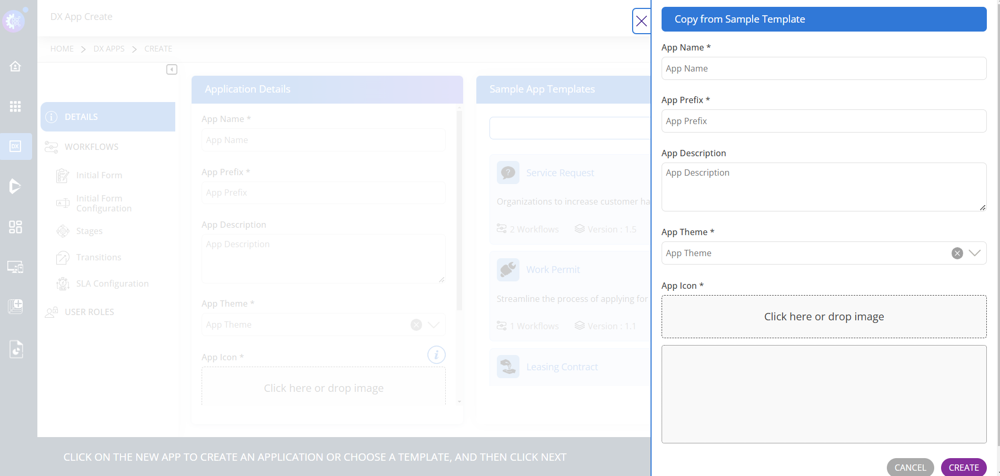
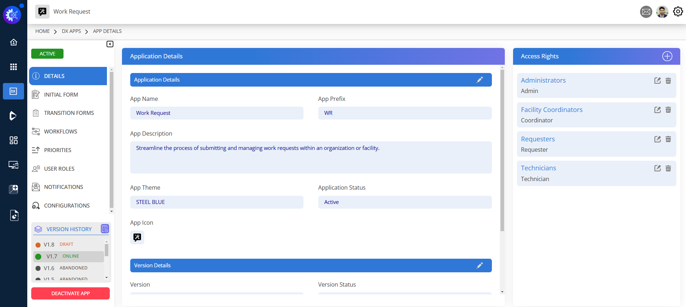
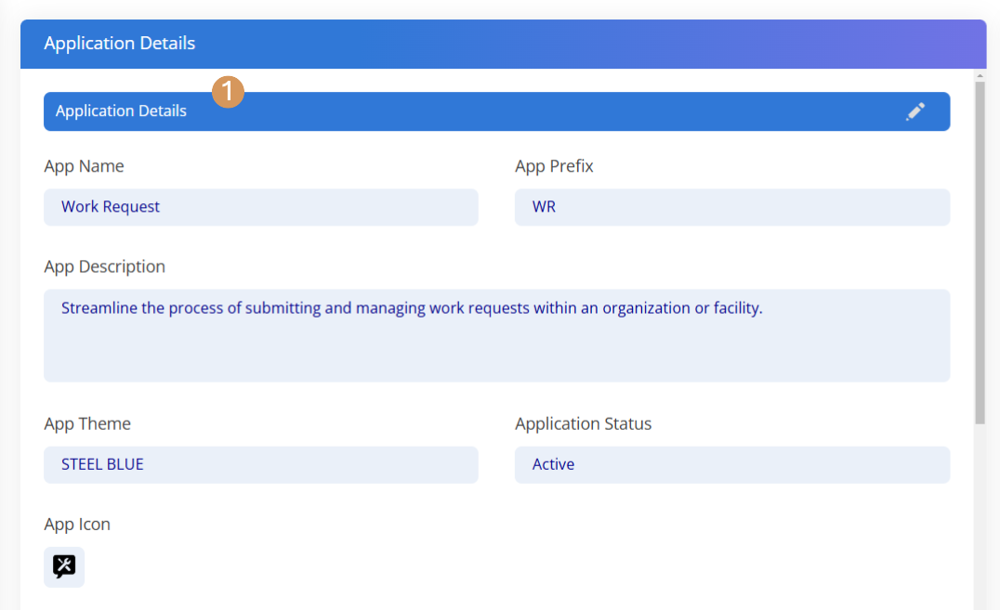
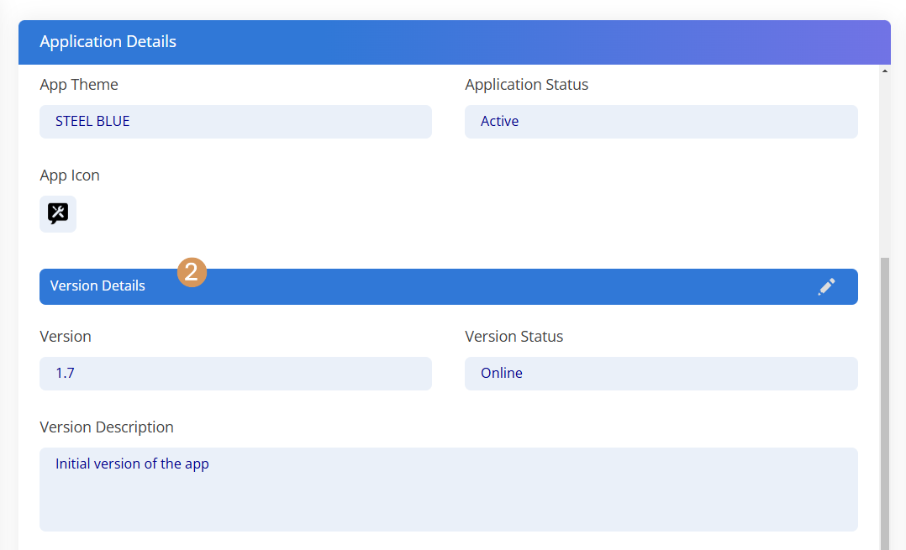

# Application Details

### Application Creation Form

**Component 1** –**Application Details**

<figure><figcaption></figcaption></figure>

In the **Application Details** section, you can fill out the required fields:

* App Name
* App Prefix
* App Theme
* App Icon

You can also provide an App Description if needed, to give users a better understanding of the application.

**Component 2** – **Sample App Templates**

**Sample App Templates** section – Use the pre-built app templates to speed up the application creation process.

* Clicking on a **Sample App Template** opens the **Copy from Sample Template** side panel, allowing you to create a new app based on an existing application.

<figure><figcaption>
Side panel view of the Copy from Sample Template
</figcaption></figure>

When you create an application from a **Sample App Template**, you automatically get all the configurations and details of that application. This includes the Initial Form details, Transition Forms, Workflows, Priorities, User Roles, Notifications, and Configurations.&#x20;

The only information you need to provide, as shown in the image, is:

* App Name
* App Prefix
* App Description
* App Theme
* App Icon

### After Creating Your Application

This is the page displayed after creating your app.

<figure><figcaption>
View of the Created Application
</figcaption></figure>

**Section 1: Application Details**

In the image below, you can see the **Application Details** section after the application is created, where you can customise the necessary details of your application.

<figure><figcaption>
Application Details Section
</figcaption></figure>

The **Application Details** consists of two sections: Application Details and Version Details.

\
The Application Details section displays key information about the application, including:

* Application Name
* App Prefix
* App Description
* App Theme
* Application Status
* App Icon

You can edit or customise these details to suit your requirements. This section also gives a high-level overview of the application.

**Section 2: Version Details**

<figure><figcaption>
Version Details Section
</figcaption></figure>

Version Details displays the current version information of the application. In this section, you can customise the following:

* Version
* Version Status
* Version Description
