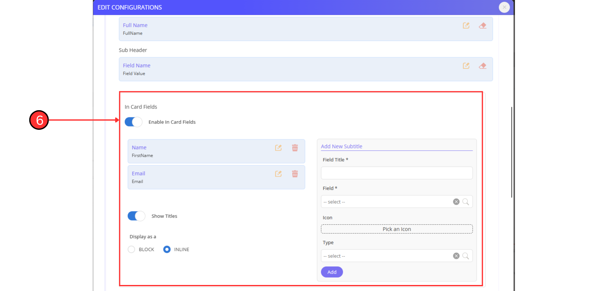
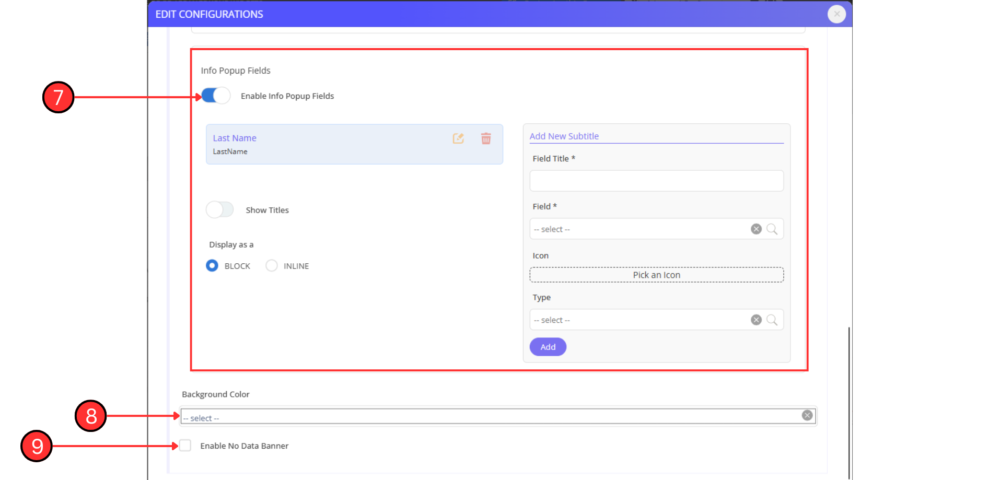

# DX Profile Details

### **1. Introduction**

<figure><figcaption></figcaption></figure>

The **DX Profile Details** widget displays detailed information about a specific object (typically a person or entity) on your dashboard. Based on the the configuration, it can retrieve the object’s details either from a DX application or directly from standard iviva.DX objects like users, departments, or locations. This widget is especially useful for providing quick reference to key people or roles associated with dashboard content, such as assignees or creators.

***

### **2. What Does It Show?**

This widget presents a clean and structured profile card, which includes:

* A profile image (if enabled)
* Main and sub-headers like full name and role
* Extra field data (e.g., email, department) in the card
* Additional information shown in a popup when the button is clicked (if configured)
* Custom background colour and fallback messaging if no match is found

The displayed information is dynamically fetched based on a query string passed in the dashboard URL.

***

### **3. Where Does the Data Come From?**

The **DX Profile Details** widget supports the following data sources:

* **iviva.DX** – The default internal source for DX application data
* **API** – Pulls data from a configured external API
* **iviva Service** – Uses a backend service to retrieve custom data
* **Lucy** – Allows data to be fetched from a low-code platform

> For this guide, we focus exclusively on configuring the **iviva.DX** data source, as the others are covered in separate documentation.

In iviva.DX, data can be sourced in **two modes** depending on the **Use DX Application** toggle:

* **If “Use DX Application” is ON**:\
  The widget fetches data from the **chosen DX application** (_e.g., Work Request)_ and displays fields defined by that app's system structure. The specific object (e.g., a user) is identified by matching the key value (e.g., user key) against the selected base field.
* **If “Use DX Application” is OFF**:\
  You can directly choose an **Object Type** such as `User`, `Assignee`, `Location`, `Member`, etc. The widget displays system-defined fields related to the chosen object type.
  &#x20;This mode is useful when no application context is required.

In both modes, the widget uses a **query string** parameter (e.g., `?key=someUserID`) to determine which object profile to display.

***

### **4. Data Source Component Breakdown**

<figure><figcaption></figcaption></figure>

**Component 1: Use DX Application Toggle**

* **ON**: Enables selection of a DX application and its base field _(e.g., Assignee_).
* **OFF**: Enables selection of a system-level **Object Type** _(e.g., User, Department)._

**Component 2: DX Application Selector** _(Visible if toggle is ON)_\
Select the DX application that contains the records whose profile details you want to display.

**Component 3: Base Field Selector** _(Visible if toggle is ON)_\
Choose the field in the selected DX app that holds the identifier (_e.g., User Key_) used to match the profile.

<figure><figcaption></figcaption></figure>

**Component 4: Object Type Selector** _(Visible if toggle is OFF)_\
Choose a system object like `User`, `BranchOffice`, `Organization`, etc. This selection defines the context and determines which predefined fields will be available for configuration and display.

***

### **5. General Details Component Breakdown**

<figure><figcaption></figcaption></figure>

<figure><figcaption></figcaption></figure>

<figure><figcaption></figcaption></figure>

**Component 1: Query String Param**\
This is the key expected in the dashboard URL (e.g., `?key=1234`). The widget uses this value to fetch and show the correct object’s profile.

**Component 2: Show Profile Icon**\
Enables a circular profile image for visual identification of the object (e.g., _user photo_).

**Component 3: Enable Headers**\
Allows display of a main heading and a subheading on the card (e.g., _Full Name and Designation_).

**Component 4: Main Header**\
Choose the field to appear prominently on the card (e.g., _Full Name_).

**Component 5: Sub Header**\
Select a secondary field to appear below the main header (e.g., _Department_).

#### **Component 6: In Card Fields**

This section allows you to **display extra details directly on the profile card**, such as _email, department, or phone number._


**Enable In Card Fields Toggle**

* Turning the **Enable In Card Fields** toggle on activates the section and allows you to configure additional fields to be shown in the card body.

**Existing Field List (Left Panel)**

* Shows all the fields currently configured to appear in the profile card.
* Each item displays:
  * **Label** (Field Title), e.g., _Name, Email_
  * **Field key**, e.g., `FirstName`, `Email`
  * **Edit icon** – Allows you to modify the field
  * **Trash icon** – Removes the field from the card

**Add New Subtitle (Right Panel)**

This section allows you to **add new data rows** to the card layout:

* **Field Title** – Display label users will see (_e.g., Email, Mobile Number)_
* **Field** – The actual system field to pull data from (selected from a dropdown)
* **Icon** – An optional icon besides the value (e.g., _envelope for email)_
* **Type** – Defines how the field is rendered (_e.g., text, link_)

Clicking the **Add** button appends the new field configuration to the card.

**Show Titles Toggle**

* If ON, each data value will be displayed with its **label** (e.g., `Name: Admin`)
* If OFF, only the values will be shown without the label

**Display As Option**

* **Block** – Each field appears on a separate line
* **Inline** – Fields appear side-by-side if space permits, creating a compact layout


**Component 7: Info Popup Fields**\
Configure extra fields to appear in a popup when the user clicks 'More Details' on the card

**Component 8: Background Colour**\
Choose a background colour to personalise or highlight the profile card.

**Component 9: Enable No Data Banner**\
Shows a message when no data is found for the provided query string value.

***

### **6. Display Options**

* **Titles Toggle**: Choose whether to show or hide field labels (e.g., '_Email:'_) in front of the values
* **Inline vs. Block Layout**: Determines how multiple fields are aligned—either side-by-side or stacked vertically
* **“More Details” Button**: Opens a popup with additional profile details, if popup fields are configured.
* **Theming Support**: Allows background colour customisation to make the card visually distinct.
* **Fallback Messaging**: Displays a 'No Data' message if no matching record is found.

***

### **7. Dashboard Visual Breakdown**

<figure><figcaption></figcaption></figure>

Shown below are the details corresponding to the final screenshot.

**Component 1: Profile Icon**

* Displays the profile image or avatar at the top-left corner (if enabled in configuration)
* Helps users quickly identify the person or object

***

**Component 2: More Details Button**

* Appears at the top-right of the card, labeled 'More Details'.
* When clicked, it opens a popup showing extra fields configured under **Info Popup Fields**

***

**Component 3: Main Header**

* Displays the **Full Name** or the main field configured
* Shown prominently as the title of the card

***

**Component 4: Subheader**

* Appears directly below the main header
* Usually shows a secondary field like _designation_ or field value.

***

**Component 5: In Card Fields Section**

* Includes additional fields like **Name** and **Email,** etc., configured in the **In Card Fields** section.
* These fields may include:
  * **Label** (e.g., Name, Email)
  * **Value** (actual data)
  * **Icon** (optional visual cue)
* Display format can be **block** or **inline**, depending on the setting.

***
