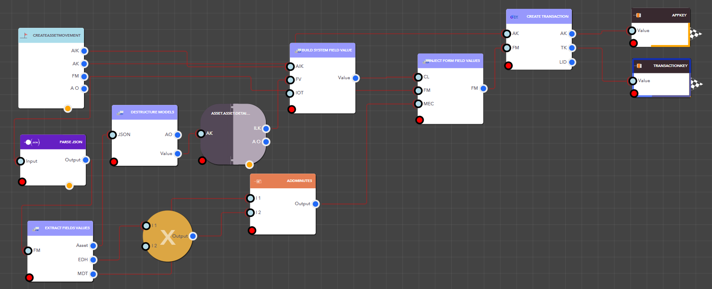

# DX Fields

## What are DX Fields?

DX Fields in Lucy are powerful tools that use Lucy Blocks to interact with and extend the field functionality in the iviva.DX platform. These fields refer to various data points or parameters used to configure and manage workflows, datasets, or assets within the DX environment.&#x20;

By using Lucy Blocks, users can create custom simulations and improve how these fields are managed, processed, and used—making it easier to replicate or enhance complex backend workflows.

