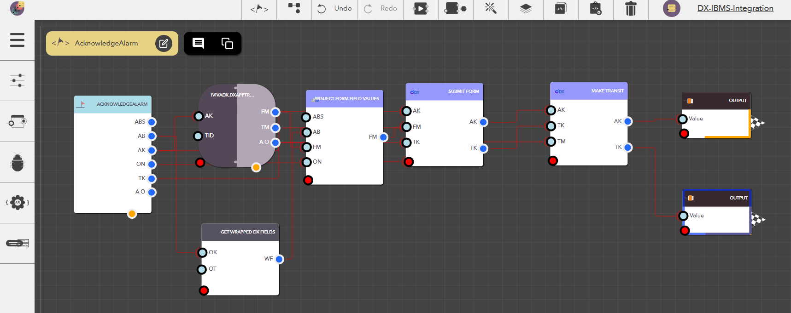

# DX General

## What is DX General?

DX General in the iviva.DX platform is a set of powerful, predefined functionalities that serve as building blocks for managing workflows, processing data, and executing backend tasks seamlessly. These functions make it easier to tackle complex operations and give you more flexibility when working in the DX environment.

