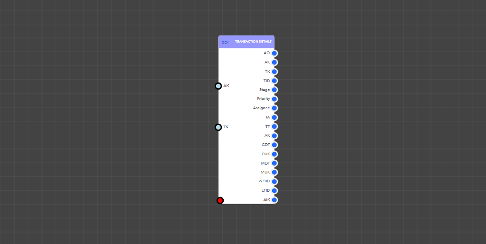

# Transaction Details

<figure><figcaption><p>Transaction Details block</p></figcaption></figure>

> ### **Input Pins**

<details>

<summary>AppKey</summary>

This is the app key for a particular application.

Data Type : <mark style="color:orange;">Integer</mark>

```
Example  :  36
```

</details>


> ### **Output Pins**


#### The Transaction Details block has multiple input pins.

You can output fields separately by including the relevant field number in the fields map.


<details>

<summary>AllOutput</summary>

Complete transaction details

Data Type : <mark style="color:orange;">**Dictionary**</mark>

```
Example  :   {
                    "TransactionKey": "7",
                    "TransactionID": "YOTEST20241119583",
                    "TransactionTag": "4540A5F1-CDE7-43E7-8D96-68814C74D722",
                    "AppKey": "36",
                    "AppInstanceKey": "1144",
                    "Stage": "Open",
                    "IsActive": "1",
                    "HasSLA": "1",
                    "WFInstanceID": "WF_1726208759899YZ49ID3LUIK",
                    "LastTransitionID": "",
                    "Priority": "{\r\n  \"id\": \"PR_1726208713477BS1QYP1MH7T\",\r\n  \"name\": \"Medium\",\r\n  \"color\": \"#e6d700\",\r\n  \"isDefault\": true,\r\n  \"DisplayText\": \"Medium\",\r\n  \"Value\": \"PR_1726208713477BS1QYP1MH7T\"\r\n}",
                    "Assignee": "",
                    "CreateSource": "Web",
                    "CreatedDateTime": "20241119:034313",
                    "CreatedUserKey": "1",
                    "ModifiedDateTime": "",
                    "ModifiedUserKey": "",
                    "AppVersion": "1.4",
                    "IsChecklistEnable": "1",
                    "IsPriorityEnable": "0",
                    "SchedulerKey": "",
                    "TargetStartDate": "",
                    "TargetEndDate": "",
                    "ScheduleSequence": "",
                    "SchedulePattern": "",
                    "ScheduleOccurrence": "0",
                    "Timezone": "LK",
                    "AppName": "TestAPIYO",
                    "AppID": "APP_1730906696750I5RD8AWGD8A",
                    "AppIconAttachmentKey": "45",
                    "AppPrimaryBackgroundColor": "#dd528b",
                    "Field1": "",
                    "Field2": "",
                    "Field3": "",
                    "Field4": "",
                    "Field5": "",
                    "Field6": "",
                    "Field7": "",
                    "Field8": "",
                    "Field9": "[[\"a\",\"b\",\"c\"],[\"d\",\"e\",\"f\"],[\"g\",\"h\",\"i\"]]",
                    "Field10": "",
                    "Field11": "",
                    "Field12": "",
                    "Field13": "",
                    "Field14": "",
                    "Field15": "",
                    "Field16": "",
                    "Field17": "",
                    "Field18": "",
                    "Field19": "",
                    "Field20": "",
                    "Field21": "",
                    "Field22": "",
                    "Field23": "",
                    "Field24": "",
                    "Field25": "",
                    "Field26": "",
                    "Field27": "",
                    "Field28": "",
                    "Field29": "",
                    "Field30": "",
                    "Field31": "",
                    "Field32": "",
                    "Field33": "",
                    "Field34": "",
                    "Field35": "",
                    "Field36": "",
                    "Field37": "",
                    "Field38": "",
                    "Field39": "",
                    "Field40": "",
                    "Field41": "",
                    "Field42": "",
                    "Field43": "",
                    "Field44": "",
                    "Field45": "",
                    "Field46": "",
                    "Field47": "",
                    "Field48": "",
                    "Field49": "",
                    "CreatedUserName": "Admin ",
                    "CreatedUserProfileImage": "",
                    "ModifiedUserName": "",
                    "ModifiedUserProfileImage": ""
                }
```

</details>

<details>

<summary>AppKey</summary>

This is the app key for a particular application.

Data Type : <mark style="color:orange;">Integer</mark>

```
Example  :  14
```

</details>

<details>

<summary>TransactionKey</summary>

Transaction Key for the generated transaction

Data Type : <mark style="color:orange;">Integer</mark>

```
Example  :  7
```

</details>

<details>

<summary>Stage</summary>

Current transaction stage

Data Type : <mark style="color:orange;">Integer</mark>

```
Example  :  7
```

</details>

<details>

<summary>Priority</summary>

Priority of the transaction

Data Type : <mark style="color:orange;">**Dictionary**</mark>

```
Example  :  "{ "id": "PR_1726208713477BS1QYP1MH7T", "name": "Medium", "color": "#e6d700", "isDefault": true, "DisplayText": "Medium", "Value": "PR_1726208713477BS1QYP1MH7T" }"
```

</details>

<details>

<summary>Assignee</summary>

Shows the user assigned to the transaction, if applicable

Data Type :<mark style="color:orange;">**String**</mark>

```
Example  :  ""
```

</details>

<details>

<summary>IsActive</summary>

Indicates whether the transaction is active

Data Type :<mark style="color:orange;">Boolean</mark>

```
Example  :  "1"
```

</details>

<details>

<summary>TransactionTag</summary>

A unique tag associated with the transaction

Data Type :<mark style="color:orange;">String</mark>

```
Example  : "4540A5F1-CDE7-43E7-8D96-68814C74D722"
```

</details>

<details>

<summary>CreatedDateTime</summary>

Date and time when the transaction was created

Data Type :<mark style="color:orange;">String</mark>

```
Example  : "20241119:034313"
```

</details>

<details>

<summary>CreatedUserKey</summary>

The key of the user who created the transaction

Data Type :<mark style="color:orange;">String</mark>

```
Example  : "1"
```

</details>

<details>

<summary>ModifiedDateTime</summary>

Date and time when the transaction was last modified

Data Type :<mark style="color:orange;">String</mark>

```
Example  : ""
```

</details>

<details>

<summary>ModifiedUserKey</summary>

Key of the user who last modified the transaction

Data Type :<mark style="color:orange;">String</mark>

```
Example  : ""
```

</details>

<details>

<summary>WFInstanceID</summary>

Workflow instance ID associated with the transaction

Data Type :<mark style="color:orange;">String</mark>

```
Example  : "WF_1726208759899YZ49ID"
```

</details>

<details>

<summary>LastTransitionID</summary>

ID of the last workflow transition

Data Type :<mark style="color:orange;">String</mark>

```
Example  : ""
```

</details>

<details>

<summary>AppInstanceKey</summary>

The key of the application instance

Data Type :<mark style="color:orange;">String</mark>

```
Example  : "1144"
```

</details>

