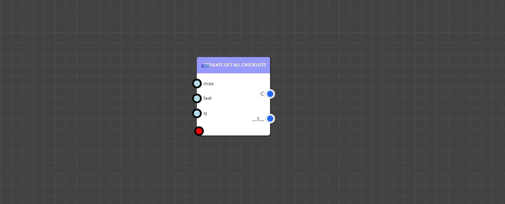
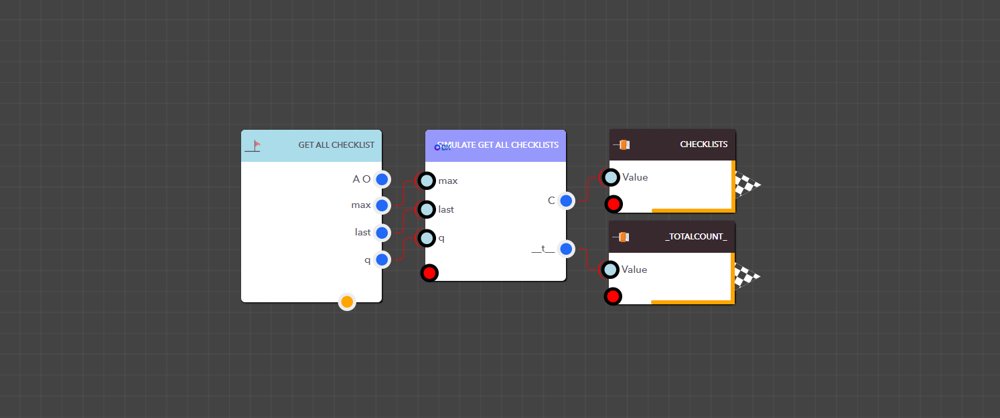

# Get All Checklists

<figure><figcaption><p>Simulate Get All Checklists block</p></figcaption></figure>

> ### **Input Pins**

<details>

<summary>max</summary>

Allows you to specify how many checklists you want to return

Data Type : <mark style="color:orange;">Integer</mark>

```
Example  :  20
```

</details>

<details>

<summary>last</summary>

Allows you to specify which record to start from, 0 means start from the first record, 1 omits the first record.

Data Type : <mark style="color:orange;">Integer</mark>

```
Example  :  0
```

</details>

<details>

<summary>q</summary>

Allows to filter by checklist ID or checklist name, just like a search filter

Data Type : String

```
Example  :  API Checklist
```

</details>

> ### **Output Pins**

<details>

<summary>Checklists</summary>

Available checklists for the DX application


Data Type : List

```
Example  : [ { "CountDurationFromTasks": "1", "Tasks": "[ { "TaskName": "Text", "AllowImageProofing": false, "Duration": 6, "IsCompleted": false, "AllowToSkipMandatoryWithComment": false, "AllowComments": false, "TaskValue": null, "FieldType": "Text", "IsMandatory": false } ]", "RequiredIndividualTaskCompletion": "0", "ModifiedUserKey": "", "ChecklistID": "CLT_1726208864368OXXB3P1X4HG", "ChecklistKey": "48", "TotalDuration": "6", "CreatedDateTime": "20240913:062800", "ChecklistName": "Checklist Name", "ModifiedDateTime": "", "Description": "", "CreatedUserKey": "1" }, { "CountDurationFromTasks": "1", "Tasks": "[ { "TaskName": "Task Name", "AllowImageProofing": false, "Duration": 5, "IsCompleted": false, "AllowToSkipMandatoryWithComment": false, "AllowComments": true, "TaskValue": null, "FieldType": "Text", "IsMandatory": false } ]", "RequiredIndividualTaskCompletion": "0", "ModifiedUserKey": "", "ChecklistID": "CLT_1727885519414EZRB9LJ2Z2O", "ChecklistKey": "49", "TotalDuration": "5", "CreatedDateTime": "20241002:161220", "ChecklistName": "Checklist Name2", "ModifiedDateTime": "", "Description": "", "CreatedUserKey": "1" } ]
```

</details>

<details>

<summary>__totalcount__</summary>

The total number of checklists


Data Type : Integer

```
Example  : 10
```

</details>

<figure><figcaption><p>Example: Using the Simulate Get All Checklists block in a real application</p></figcaption></figure>
