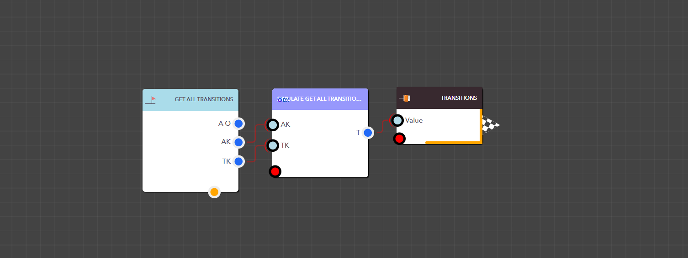

# Get All Transitions

<figure><figcaption><p>Simulation Get All Transition block </p></figcaption></figure>

<details>

<summary>AppKey</summary>

This is the app key for a particular application.

Data Type : <mark style="color:orange;">Integer</mark>

```
Example  :  35
```

</details>

<details>

<summary>TransactionKey</summary>

The Transaction Key of the required transaction

Data Type : <mark style="color:orange;">Integer</mark>

```
Example  :  6
```

</details>

> ### **Output Pins**

<details>

<summary>Transitions</summary>

Available transitions for the transaction


Data Type : Dictionary

```
Example  : { "Id": "TS_17303499864332177FGR0Y9V", "Label": "Complete Work", "FromStage": { "name": "In-Progress", "isActive": true }, "ToStage": { "name": "Completed", "isActive": true }, "FieldTemplates": {} } 
```

</details>

<figure><figcaption><p>Example: Using the Simulation Get All Transition block in a real application</p></figcaption></figure>
