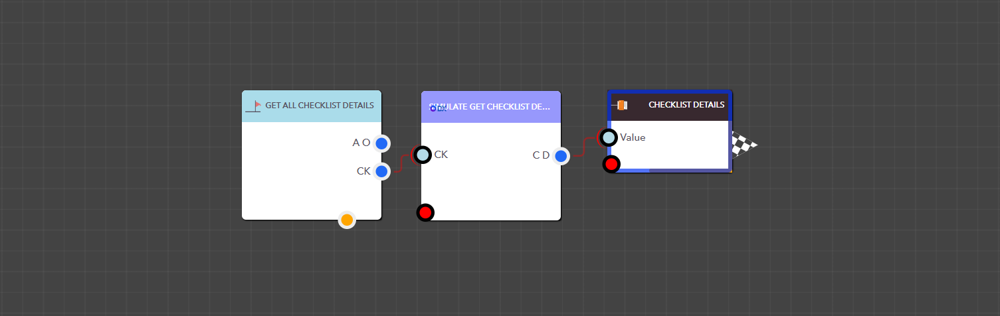

# Get Checklist Details

<figure><figcaption><p> Simulation Get Checklist Details block </p></figcaption></figure>

<details>

<summary>ChecklistKey</summary>

The Checklist key that corresponds to the checklist you need

Data Type : <mark style="color:orange;">Integer</mark>

```
Example  :  49
```

</details>

> ### **Output Pins**

<details>

<summary>Checklist Details</summary>

Checklist details

Data Type : Dictionary

```
Example  : { "CountDurationFromTasks": "1", "Tasks": "[ { "TaskName": "Task Name", "AllowImageProofing": false, "Duration": 5, "IsCompleted": false, "AllowToSkipMandatoryWithComment": false, "AllowComments": true, "TaskValue": null, "FieldType": "Text", "IsMandatory": false } ]", "RequiredIndividualTaskCompletion": "0", "ModifiedUserKey": "", "ChecklistID": "CLT_1727885519414EZRB9LJ2Z2O", "ChecklistKey": "49", "TotalDuration": "5", "CreatedDateTime": "20241002:161220", "ChecklistName": "Checklist Name2", "ModifiedDateTime": "", "Description": "", "CreatedUserKey": "1" }
```

</details>

<figure><figcaption><p>Example: Using the Simulate Get Checklist Details block in a real application</p></figcaption></figure>
