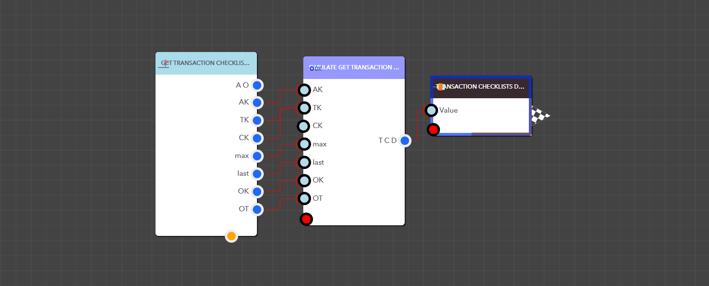

# Get Transaction Checklist Details

The Simulate Get Transaction Checklist Details block returns checklists linked to a specific transaction in an app, filtered by the Checklist Key. To retrieve checklists, you need to provide the App Key, Transaction Key, and the Checklist Key.


<figure><figcaption><p>Simulate Get Transaction Checklist Details block </p></figcaption></figure>

> ### **Input Pins**

<details>

<summary>AppKey</summary>

This is the App Key for a particular application.

Data Type : <mark style="color:orange;">Integer</mark>

```
Example  :  35
```

</details>

<details>

<summary>TransactionKey</summary>

This is the Transaction Key for the transaction.

Data Type : <mark style="color:orange;">Integer</mark>

```
Example  :  6
```

</details>

<details>

<summary>ChecklistKey</summary>

This is the Checklist Key for the checklist.

Data Type : <mark style="color:orange;">Integer</mark>

```
Example  :  49
```

</details>

<details>

<summary>max</summary>

Lets you specify the number of checklists to return

Data Type : <mark style="color:orange;">Integer</mark>

```
Example  :  20
```

</details>

<details>

<summary>last</summary>

Lets you choose where to start retrieving records—0 starts from the beginning, 1 skips the first record

Data Type : <mark style="color:orange;">Integer</mark>

```
Example  :  0
```

</details>

<details>

<summary>q</summary>

Acts like a search filter to narrow results by checklist ID or checklist name.

Data Type : String

```
Example  :  API Checklist
```

</details>

<details>

<summary>ObjectKey</summary>

Allows you to filter checklists by their Object Key

Data Type : <mark style="color:orange;">Integer</mark>

```
Example  :  1
```

</details>

<details>

<summary>ObjectType</summary>

Allows you to filter checklists by their Object Type

Data Type : String

```
Example  :  Asset
```

</details>

> ### **Output Pins**

<details>

<summary>Transaction Checklist Details</summary>

Filters checklists by the Checklist Key within a specific transaction in the DX app


Data Type : List

```
Example  : [ { "CountDurationFromTasks": "1", "Tasks": "[ { "AllowImageProofing": false, "IsCompleted": false, "Attachments": [], "Comments": [], "Duration": 6, "AllowComments": false, "AllowToSkipMandatoryWithComment": false, "TaskName": "Text", "TaskValue": null, "FieldType": "Text", "IsMandatory": false } ]", "RequiredIndividualTaskCompletion": "0", "ChecklistID": "CLT_1726208864368OXXB3P1X4HG", "row_id": "1", "ChecklistKey": "48", "totalcount": "1", "Completed": "0", "TotalDuration": "6", "TransactionKey": "7", "TargetEndDate": "", "TargetStartDate": "", "IsSystemGenerated": "0", "SchedulerKey": "", "AppKey": "35", "ChecklistMapKey": "1", "ChecklistName": "Checklist Name", "Description": "", "Objects": "[]" } ]
```

</details>

<details>

<summary>__totalcount__</summary>

Total number of checklists


Data Type : Integer

```
Example  : 10
```

</details>

<figure><figcaption><p>Example: Using the Simulate Get Transaction Checklist Details block in a real application</p></figcaption></figure>
