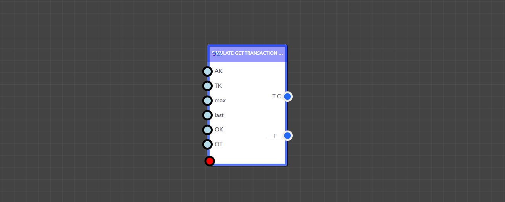
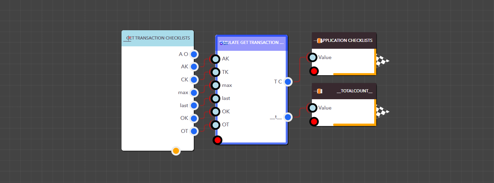

# Get Transaction Checklists

The Simulate Get Transaction Checklists block returns all checklists tied to a specific transaction in your DX app. To retrieve them, provide the app key, transaction key, checklist key, and the following parameters: max, last, q, object key, and object type.

<figure><figcaption><p> Simulate Get Transaction Checklists block </p></figcaption></figure>

<details>

<summary>AppKey</summary>

This is the app key for a particular application.

Data Type : <mark style="color:orange;">Integer</mark>

```
Example  :  35
```

</details>

<details>

<summary>TransactionKey</summary>

Transaction Key of the required transaction

Data Type : <mark style="color:orange;">Integer</mark>

```
Example  :  6
```

</details>

<details>

<summary>ChecklistKey</summary>

Checklist key for the checklist you want

Data Type : <mark style="color:orange;">Integer</mark>

```
Example  :  49
```

</details>

<details>

<summary>max</summary>

Allows you to specify how many checklists you want to get

Data Type : <mark style="color:orange;">Integer</mark>

```
Example  :  20
```

</details>

<details>

<summary>last</summary>

Allows you to choose where to start pulling data—0 starts at the first record, 1 skips it

Data Type : <mark style="color:orange;">Integer</mark>

```
Example  :  0
```

</details>

<details>

<summary>q</summary>

Allows to filter checklists by checklist id or checklist name

Data Type : String

```
Example  :  API Checklist
```

</details>

<details>

<summary>ObjectKey</summary>

Allows you to filter checklists by their object key

Data Type : <mark style="color:orange;">Integer</mark>

```
Example  :  1
```

</details>

<details>

<summary>ObjectType</summary>

Allows you to filter checklists by their object types

Data Type : String

```
Example  :  Asset
```

</details>

> ### **Output Pins**

<details>

<summary>Transaction Checklists</summary>

Checklists linked to a particular transaction in a DX application


Data Type : List

```
Example  : [ { "CountDurationFromTasks": "1", "Tasks": "[ { "AllowImageProofing": false, "IsCompleted": false, "Attachments": [], "Comments": [], "Duration": 6, "AllowComments": false, "AllowToSkipMandatoryWithComment": false, "TaskName": "Text", "TaskValue": null, "FieldType": "Text", "IsMandatory": false } ]", "RequiredIndividualTaskCompletion": "0", "ChecklistID": "CLT_1726208864368OXXB3P1X4HG", "row_id": "1", "ChecklistKey": "48", "totalcount": "1", "Completed": "0", "TotalDuration": "6", "TransactionKey": "7", "TargetEndDate": "", "TargetStartDate": "", "IsSystemGenerated": "0", "SchedulerKey": "", "AppKey": "35", "ChecklistMapKey": "1", "ChecklistName": "Checklist Name", "Description": "", "Objects": "[]" } ]
```

</details>

<details>

<summary>__totalcount__</summary>

Total number of checklists


Data Type : Integer

```
Example  : 10
```

</details>

<figure><figcaption><p>Example: Using the Simulation Get Transaction Checklists block in a real application</p></figcaption></figure>
