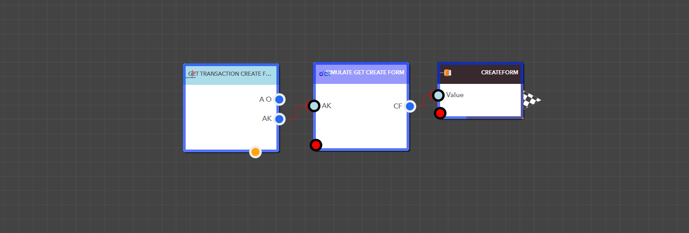

# Get Transaction Create Form

<figure><figcaption><p>Simulate Get Create Form Block</p></figcaption></figure>

<details>

<summary>AppKey</summary>

This is the app key for a particular application.

Data Type : <mark style="color:orange;">Integer</mark>

```
Example  :  35
```

</details>

> ### **Output Pins**

<details>

<summary>CreateForm</summary>

The app’s Create form


Data Type : Dictionary

```
Example  :  { "Result": "{ "Name": "test", "ID": "FM_1730349986433CFFLY5W0I", "FieldTemplates": { "Text": { "FieldType": "Text", "ValueType": "String", "Example": "Example Text" } } }" }
```

</details>

<figure><figcaption><p>Example: Using the Simulate Get Create Form Block in a real application</p></figcaption></figure>
