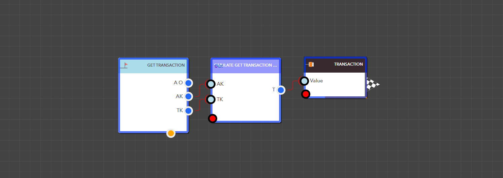

# Get Transaction Details

The Simulate Get Transaction Detail block lets you fetch a specific transaction tied to an app by providing the App Key and Transaction Key. It is a fast and simple way to get the transaction details you need.

<figure><figcaption><p>Simulate Get Transaction Detail block</p></figcaption></figure>


<details>

<summary>AppKey</summary>

This is the app key for a particular application.

Data Type : <mark style="color:orange;">Integer</mark>

```
Example  :  35
```

</details>

<details>

<summary>TransactionKey</summary>

This is the Transaction Key of the required transaction.

Data Type : <mark style="color:orange;">Integer</mark>

```
Example  :  6
```

</details>

> ### **Output Pins**

<details>

<summary>Transaction</summary>

Transactions associate with the app

Data Type : <mark style="color:orange;">List</mark>

```
Example  :  { "TextNew": "Changed", "ModifiedUserProfileImage": "", "AppInstanceKey": "1138", "Text": "", "ModifiedUserKey": "1", "Stage": "Open", "AppIconAttachmentKey": "44", "TargetStartDate": "", "AppKey": "35", "Assignee": "", "Timezone": "LK", "ScheduleOccurrence": "0", "Tag": "C3358CEA-2246-427A-AB60-93DB8B4846BA", "SchedulerKey": "", "TransactionKey": "6", "ScheduleSequence": "", "CreatedBy": "Admin ", "IsPriorityEnable": "0", "__totalcount__": "6", "TargetEndDate": "", "ModifiedBy": "Admin ", "Id": "API20241104570", "Active": "1", "AppVersion": "1.2", "CreatedUserKey": "1", "MainCSSClass": "steel-blue", "IsChecklistEnable": "0", "SchedulePattern": "", "Source": "Web", "Created": "20241104:092417", "WFInstanceID": "WF_1730350034015KIEZIT02UW", "Modified": "20241104:092438", "CreatedUserProfileImage": "" }
```

</details>

<figure><figcaption><p>Example: Using the Simulate Get Transaction Detail block in a real application</p></figcaption></figure>
