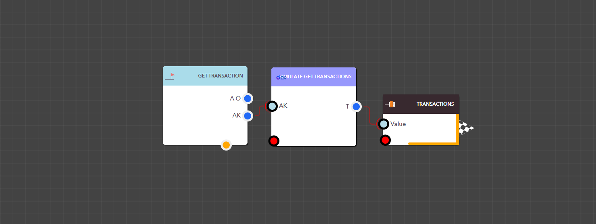

# Get Transactions


<figure><figcaption><p>Simulate Get Transactions block</p></figcaption></figure>


<details>

<summary>AppKey</summary>

This is the app key for a particular application.

Data Type : <mark style="color:orange;">Integer</mark>

```
Example  :  14
```

</details>


> ### **Output Pins**

<details>

<summary>Transactions</summary>

Transactions for the selected app.

Data Type : <mark style="color:orange;">List</mark>

```
Example  :  [ { "TextNew": "Changed", "ModifiedUserProfileImage": "", "AppInstanceKey": "1138", "Text": "", "ModifiedUserKey": "1", "Stage": "Open", "AppIconAttachmentKey": "44", "TargetStartDate": "", "AppKey": "35", "Assignee": "", "Timezone": "LK", "ScheduleOccurrence": "0", "Tag": "C3358CEA-2246-427A-AB60-93DB8B4846BA", "SchedulerKey": "", "TransactionKey": "6", "ScheduleSequence": "", "CreatedBy": "Admin ", "IsPriorityEnable": "0", "__totalcount__": "6", "TargetEndDate": "", "ModifiedBy": "Admin ", "Id": "API20241104570", "Active": "1", "AppVersion": "1.2", "CreatedUserKey": "1", "MainCSSClass": "steel-blue", "IsChecklistEnable": "0", "SchedulePattern": "", "Source": "Web", "Created": "20241104:092417", "WFInstanceID": "WF_1730350034015KIEZIT02UW", "Modified": "20241104:092438", "CreatedUserProfileImage": "" }, { "TextNew": "YoHI", "ModifiedUserProfileImage": "", "AppInstanceKey": "1138", "Text": "", "ModifiedUserKey": "1", "Stage": "In-Progress", "AppIconAttachmentKey": "44", "TargetStartDate": "", "AppKey": "35", "Assignee": "", "Timezone": "LK", "ScheduleOccurrence": "0", "Tag": "11BBD197-2395-4421-84ED-B3F9C4F63848", "SchedulerKey": "", "TransactionKey": "5", "ScheduleSequence": "", "CreatedBy": "Admin ", "IsPriorityEnable": "0", "__totalcount__": "6", "TargetEndDate": "", "ModifiedBy": "Admin ", "Id": "API20241104569", "Active": "1", "AppVersion": "1.2", "CreatedUserKey": "1", "MainCSSClass": "steel-blue", "IsChecklistEnable": "0", "SchedulePattern": "", "Source": "Web", "Created": "20241104:085813", "WFInstanceID": "WF_1730350034015KIEZIT02UW", "Modified": "20241104:085933", "CreatedUserProfileImage": "" } ]
```

</details>

<figure><figcaption><p>Example: Using the Simulate Get Transactions block in a real application</p></figcaption></figure>

