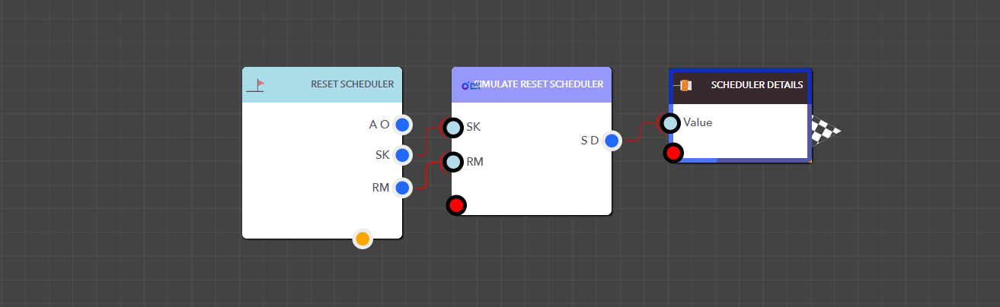

# Reset Scheduler

<figure><figcaption><p>Simulate Reset Scheduler Block</p></figcaption></figure>

> ### **Input Pins**

<details>

<summary>SchedulerKey</summary>

The Scheduler Key for the scheduler

Data Type : <mark style="color:orange;">Integer</mark>

```
Example  :  5
```

</details>

<details>

<summary>ResetMode</summary>

The ResetMode specifies how you want to reset the scheduled transaction. Available options: DeleteAll, DeleteUpcoming, and DeleteNone.

Data Type : <mark style="color:orange;">String</mark>

```
Example  :  DeleteNone
```

</details>

> ### **Output Pins**

<details>

<summary>Scheduler Details</summary>

Shows the scheduler's status after resetting

Type : Dictionary

```
Example  : { "SchedulerKey": "5", "ObjectKey": "5", "Status": "Updated" } 
```

</details>

<figure><figcaption><p>Example: Using the Simulate Reset Scheduler Block in a real application</p></figcaption></figure>
