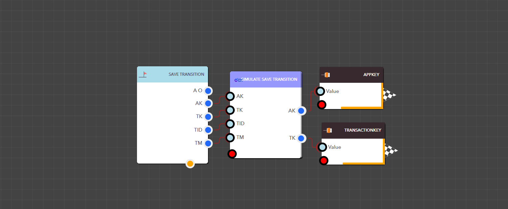

# Transaction Save Transition


<figure><figcaption><p>Simulate Save Transition Block</p></figcaption></figure>

> ### **Input Pins**


#### The Simulate Save Transition block has multiple input pins.

You can provide individual pins that match each search ID.
\
For example, if a text field has the search ID Text, you can give it a value like 'ExampleTest', and that will be assigned to that specific field.


<details>

<summary>AppKey</summary>

This is the app key for a particular application.

Data Type : <mark style="color:orange;">Integer</mark>

```
Example  :  14
```

</details>

<details>

<summary>TransactionKey</summary>

This is the transaction key for the transaction that is being updated.

Data Type : <mark style="color:orange;">Integer</mark>

```
Example  :  112
```

</details>

<details>

<summary>TransitionID</summary>

The Transition ID allows you to update the transaction's stage.

Data Type : String

```
Example  :  TS_17303499864339ZKTI8QGMCV
```

</details>


> ### **Output Pins**

<details>

<summary>AppKey</summary>

This is the app key for a specific app.

Data Type : <mark style="color:orange;">Integer</mark>

```
Example  :  14
```

</details>

<details>

<summary>TransactionKey</summary>

This is the transaction key for the generated transaction.

Data Type : <mark style="color:orange;">Integer</mark>

```
Example  :  112
```

</details>

<figure><figcaption><p>Example: Using the Simulate Save Transition block in a real application</p></figcaption></figure>
