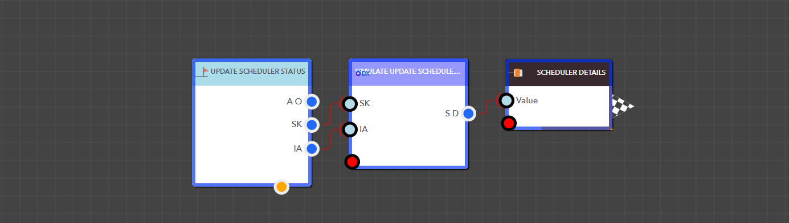

# Update Scheduler Status


<figure><figcaption><p>Simulate Update Scheduler Status block </p></figcaption></figure>

> ### **Input Pins**

<details>

<summary>SchedulerKey</summary>

This is the Scheduler Key for the scheduler.

Data Type : <mark style="color:orange;">Integer</mark>

```
Example  :  5
```

</details>

<details>

<summary>IsActive</summary>

'**IsActive'** indicates the status of the scheduler. If the value is 1, the scheduler is active; otherwise, it is inactive.

Data Type : Boolean

```
Example  :  1
```

</details>

> ### **Output Pins**

<details>

<summary>Scheduler Details</summary>

Shows the scheduler's status after it has been updated

Type : Dictionary

```
Example  : { "SchedulerKey": "5", "ObjectKey": "5", "Status": "Updated" } 
```

</details>

<figure><figcaption><p>Example: Using the Simulate Update Scheduler Status block in a real application</p></figcaption></figure>
