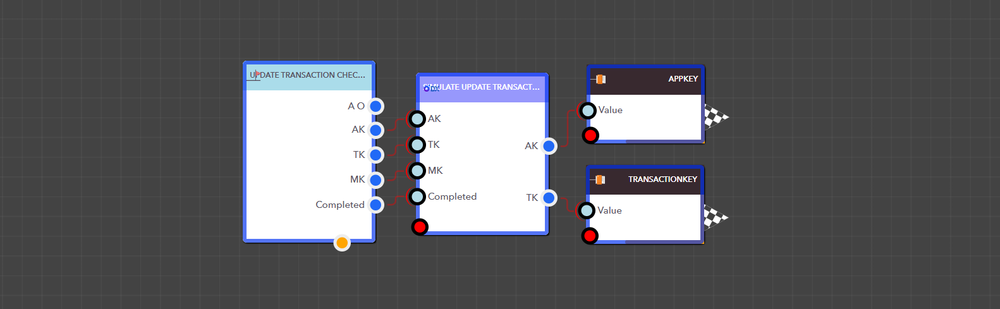

# Update Transaction Checklist Status

The Simulate Update Transaction Checklist Status block updates the status of a checklist in a transaction. To update the checklist status, provide the following: App key, Transaction key, Map key, and Completed (set to true or false).

<figure><figcaption><p>Simulate Update Transaction Checklist Status block </p></figcaption></figure>

<details>

<summary>AppKey</summary>

This is the app key for a particular application.

Data Type : <mark style="color:orange;">Integer</mark>

```
Example  :  35
```

</details>

<details>

<summary>TransactionKey</summary>

This is the Transaction Key for the transaction.

Data Type : <mark style="color:orange;">Integer</mark>

```
Example  :  6
```

</details>

<details>

<summary>MapKey</summary>

This is the Checklist Map Key for the checklist in the transaction.

Data Type : <mark style="color:orange;">Integer</mark>

```
Example  :  1
```

</details>

<details>

<summary>Completed</summary>

The Checklist status must be either true or false.

Data Type : <mark style="color:orange;">Boolean</mark>

```
Example  :  1
```

</details>

> ### **Output Pins**

<details>

<summary>AppKey</summary>

This is the app key for a particular application.

Data Type : <mark style="color:orange;">Integer</mark>

```
Example  :  35
```

</details>

<details>

<summary>TransactionKey</summary>

This is the Transaction Key of the specified transaction.

Data Type : <mark style="color:orange;">Integer</mark>

```
Example  :  6
```

</details>

<figure><figcaption><p>Example: Using the Simulate Update Transaction Checklist Status block in a real application</p></figcaption></figure>
