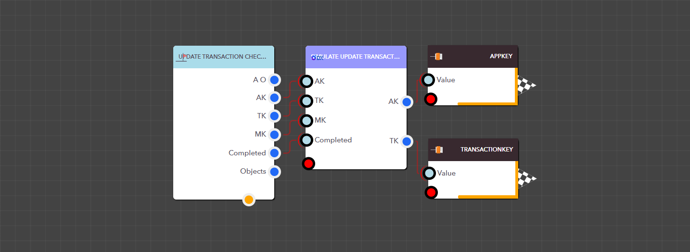

# Update Transaction Checklist Task Status

The Simulate Update Transaction Checklist Task Status block updates the status of a task within a transaction’s checklist. To update the task status, you will need to provide the following: App key, Transaction key , Checklist Map key, Task Index, and IsCompleted (set to true or false).


<figure><figcaption><p>Simulate Update Transaction Checklist Task Status block</p></figcaption></figure>

> ### **Input Pins**

<details>

<summary>AppKey</summary>

This is the app key for a particular application.

Data Type : <mark style="color:orange;">Integer</mark>

```
Example  :  35
```

</details>

<details>

<summary>TransactionKey</summary>

This is the Transaction Key for the relevant transaction.

Data Type : <mark style="color:orange;">Integer</mark>

```
Example  :  6
```

</details>

<details>

<summary>MapKey</summary>

This is the Checklist Map Key for the checklist within the transaction.

Data Type : <mark style="color:orange;">Integer</mark>

```
Example  :  1
```

</details>

<details>

<summary>TaskIndex</summary>

This is the Task Index of the task you are updating in the task list.

Data Type : <mark style="color:orange;">Integer</mark>

```
Example  :  1
```

</details>

<details>

<summary>IsCompleted</summary>

The task status must be set to either true or false.

Data Type : <mark style="color:orange;">Boolean</mark>

```
Example  :  1
```

</details>

> ### **Output Pins**

<details>

<summary>AppKey</summary>

This is the app key for a particular application.

Data Type : <mark style="color:orange;">Integer</mark>

```
Example  :  35
```

</details>

<details>

<summary>TransactionKey</summary>

This is the Transaction Key for the relevant transaction.

Data Type : <mark style="color:orange;">Integer</mark>

```
Example  :  6
```

</details>

<details>

<summary>MapKey</summary>

This is the Checklist Map key for the updated checklist within the transaction.

Data Type : <mark style="color:orange;">Integer</mark>

```
Example  :  1
```

</details>

<figure><figcaption><p>Example: Using the Simulate Update Transaction Checklist Task Status block in a real application</p></figcaption></figure>
