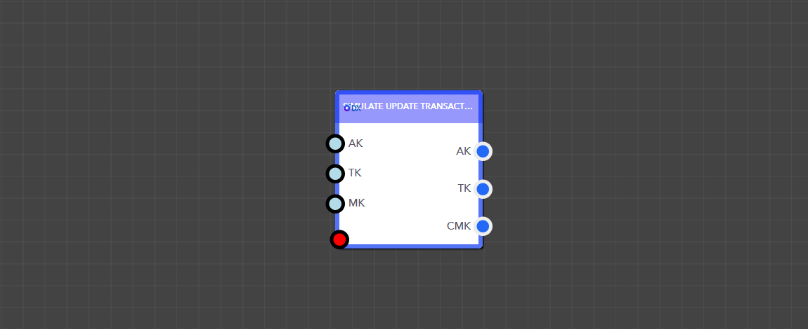
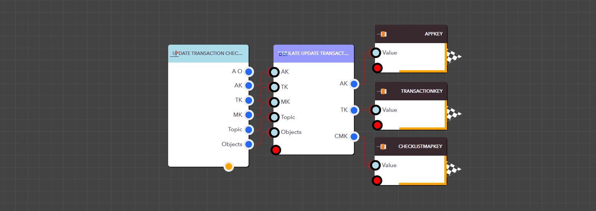

# Update Transaction Checklist

<figure><figcaption><p>Simulate Update Transaction Checklists block</p></figcaption></figure>

> ### **Input Pins**


#### The Simulate Update Transaction Checklists block has multiple input pins.

You can update the following pins:`ChecklistName`(String), `TotalDuration`(Integer), `CountDurationFromTasks`(Integer), `RequiredIndividualTaskCompletion`(Boolean), `Topic`(String), `Objects`(Dictionary).

Note: A checklist can have either **Topics** or **Objects,** but not both.




<details>

<summary>AppKey</summary>

This is the app key for a particular application.

Data Type : <mark style="color:orange;">Integer</mark>

```
Example  :  14
```

</details>

<details>

<summary>TransactionKey</summary>

This is the Transaction Key for the transaction you are updating.

Data Type : <mark style="color:orange;">Integer</mark>

```
Example  :  112
```

</details>

<details>

<summary>MapKey</summary>

The Checklist Map Key for the required checklist in the transaction

Data Type : <mark style="color:orange;">Integer</mark>

```
Example  :  1
```

</details>


> ### **Output Pins**

<details>

<summary>AppKey</summary>

This is the app key for a particular application.

Data Type : <mark style="color:orange;">Integer</mark>

```
Example  :  14
```

</details>

<details>

<summary>TransactionKey</summary>

The Transaction Key for the generated transaction

Data Type : <mark style="color:orange;">Integer</mark>

```
Example  :  112
```

</details>

<details>

<summary>ChecklistMapKey</summary>

The Checklist Map Key for the updated checklist in the transaction

Data Type : <mark style="color:orange;">Integer</mark>

```
Example  :  1
```

</details>

<figure><figcaption><p>Example: Using the Simulate Update Transaction Checklists block in a real application</p></figcaption></figure>
