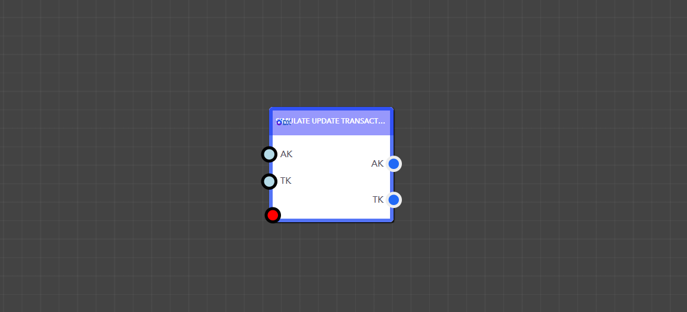

# Update Transaction

<figure><figcaption><p> Simulate Update Transaction Block </p></figcaption></figure>

> ### **Input Pins**


#### The Simulate Update Transaction block has multiple input pins.

You can provide individual pins for each search ID. For example, if a text field has the search ID 'Text', you can give it a value like 'ExampleTest', and that will be assigned to the field.




<details>

<summary>AppKey</summary>

This is the app key for a particular application.

Data Type : <mark style="color:orange;">Integer</mark>

```
Example  :  1
```

</details>

<details>

<summary>TransactionKey</summary>

This is the Transaction Key of the generated transaction.

Data Type : <mark style="color:orange;">Integer</mark>

```
Example  :  5
```

</details>


> ### **Output Pins**

<details>

<summary>AppKey</summary>

This is the app key for a particular application.

Data Type : <mark style="color:orange;">Integer</mark>

```
Example  :  1
```

</details>

<details>

<summary>TransactionKey</summary>

This is the Transaction Key of the generated transaction.

Data Type : <mark style="color:orange;">Integer</mark>

```
Example  :  5
```

</details>

<figure><figcaption><p>Example of using the Simulate Update Transaction Block in a real application</p></figcaption></figure>
